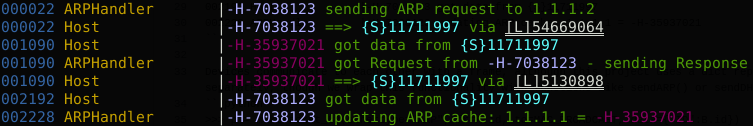
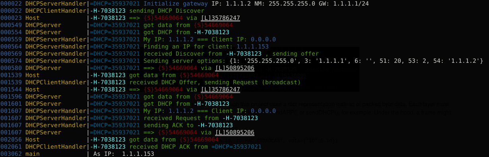
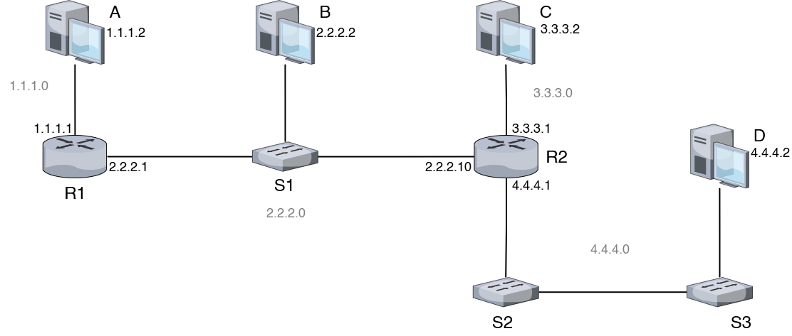

# Routing

The purpose of this project is to provide a network simulation framework up to Layer 4. Several classes are provided, mimicking their hardware equivalents.
 - Switch
 - Host
 - Router

At this point, supported protocols include:
 - ARP
 - DHCP
 - ICMP

In our simulation, we are able to connect a topology together in an intuitive way. Here we form a basic 4 device LAN:

>. 

We can initialize it as such:

```python
A = Host(["1.1.1.2/24"])
B = Host(["1.1.1.3/24"])
C = Host(["1.1.1.4/24"])
S1 = Switch([A, B, C])
A.sendARP(B.getIP())
```


Optionally, Devices don't need an initial IP:

```python
A = Host()
D1 = DHCPServer("1.1.1.2/24", gateway="1.1.1.1/24", debug=1)
S1 = Switch([A, D1], debug=0)

A.sendDHCP("init", timeout=5)
pprint("As IP: ", A.getIP())
```



We can construct an arbitrary toplogy without much fuss:

> 

```python
A = Host(["1.1.1.2/24"])
B = Host(["2.2.2.2/24"])
C = Host(["3.3.3.2/24"])
D = Host(["4.4.4.2/24"])

A.interfaces[0].gateway = "1.1.1.1/24"
B.interfaces[0].gateway = "2.2.2.1/24" # Bs default gateway is R1!

S1 = Switch([B], debug=0)
R1 = Router(["1.1.1.1/24", "2.2.2.1/24"], [A, S1])

S3 = Switch([D], debug=0)
S2 = Switch([S3], debug=0)
R2 = Router(["2.2.2.10/24", "3.3.3.1/24", "4.4.4.1/24"], [S1, C, S2])
```


Devices communicate to each other with a frame, although this project uses a dict representation instead of packed byte data. Each layer must be built separately, though we wrap this functionality with functions like sendARP() or sendDHCP() for example, as seen above. Under the hood, a frame might look like:
```python
>>> p = makePacket_L2(ethertype="ARP", fr=A.id, to=MAC_BROADCAST, data={"ID":B.id})
>>> p
{
  "EtherType":"ARP",
  "From":<A MAC>,
  "To":<MAC BROADCAST ADDR>,
  "FromLink":<LINK ID> # Used identify which interface a frame comes from, in lieu of an actual hardware port
  "Data": {"ID": <B MAC>}
}
```
Where the Data field would then store L3 information, whose Data field would contain L4 information...

When we send() data, we don't send TO a host, rather we output on an interface. Every Device has a list of Interfaces. We then rely on the frame and other hardware to get it where it needs to go.

Here, we send p on A's only interface.

```python
>>> A.send(p) # onlink param default value is self.interfaces[0]. Fine for a host with only one interface
```

We can also specify a specific interface, good for devices with several interfaces, like a Router or Switch:

```python
>>> A.send(p, A.interfaces[0])
```
