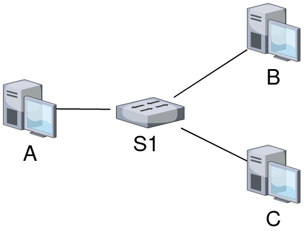

# Routing

The purpose of this project is to provide a network simulation framework up to Layer 4. Several classes are provided, mimicking their hardware equivalents:
 - Device (Abstract Base Class)
 - Switch
 - Host
 - Router
 - Link

In our simulation, we are able to connect a topology together in an intuitive way. Here we form a basic 4 device LAN:

>. 

We can initialize it as such:

```python
A, B, C = Host(), Host(), Host()
S1 = Switch()

L1 = Link([A, S1])
L2 = Link([B, S1])
L3 = Link([C, S1])

initLinks([L1, L2, L3])
```

Packets / Frames sent don't (yet) follow an RFC, they are just a dictionary. In our example, host A sends an ARP request looking for host B:
```python
>>> p = makePacket(name="ARP", fr=A.id, to=MAC_BROADCAST, data=data={"ID":B.id})
>>> p
{
  "Name":"ARP",
  "From":<A MAC HERE>,
  "To":<MAC BROADCAST ADDR>,
  "FromLink":<LINK ID> # Used identify which interface a frame comes from, in lieu of an actual hardware port
  "Data": {"ID": <B MAC HERE>}
}
```

When we send() data, we don't send TO a host, rather we output on an interface. We then rely on the frame and other hardware to get it where it needs to go. Here, we send p on A's only interface.

```python
>>> A.send(p) # onlink param default value is self.interfaces[0]. Fine for a host with only one interface
```

Alternatively, we can send on a specific device interface if we desire if we're sending from a switch or other multi-interface Device:

```python
>>> A.send(p, L1)               # Call it by name directly
>>> A.send(p, A.interfaces[0])  # Or pass it in from the instance
>>> A.send(p, L2)               # Naturally, L2 is not connected to A, so this is undefined behavior
```

We can see the updated ARP caches of several of the devices, in the form of:
```
<Device ID>:<Interface Link ID>
```
```python
>>> A.mti # MAC to Interface
>>> {'-H-54669064': '[L]71977819'}
>>> S1.mti
>>> {'-H-35937021': '[L]71977819', '-H-54669064': '[L]75483140'}
```
